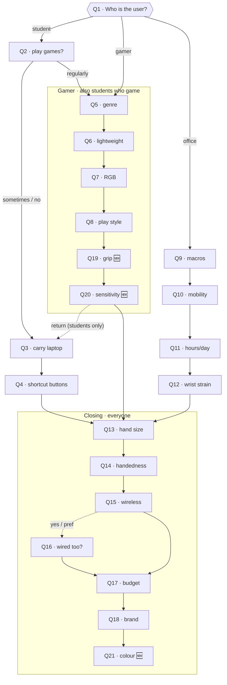

---
aliases:
  - Question Map
  - Questionnaire Mapping
tags:
  - lumino/algorithm
  - questionnaire
  - reference
related:
  - "[[recommend]]"
  - "[[rules]]"
  - "[[models]]"
created: 2026-06-28
---

# Questionnaire → DB field → rule/scoring map

How each questionnaire answer feeds the [[recommend|recommendation algorithm]].

> [!info] Legend
> - **Fact** — the key in the `recommend(payload)` dict (`_build_facts`).
> - **DB field(s)** — the `Mouse` / related-table columns the rule reads (see [[models]]).
> - **Type** — `HARD` (filters candidates out) or `SOFT` (adds/subtracts score).
> - ✅ already wired in [[rules]] · 🆕 proposed (data collected, no rule yet).

## Flow at a glance

## Everyone

| Q | Question | Fact | DB field(s) | Type | Scoring logic |
|---|---|---|---|---|---|
| 1 | Main user | `user_type` | — | — | Selects the rule set (gamer / student / office). |
| 13 | Hand size | `hand_size` | `mouse_model.length` | HARD ✅ | small `<115mm`, medium `115–130`, large `>130`. |
| 14 | Handedness | `left_hand` | `mouse_model.left_fit` | SOFT ✅ | left/either → require/boost `left_fit = true`. |
| 15 | Wireless preference | `wireless` | `mouse_connectivity.bluetooth/dongle/wired` | HARD/SOFT ✅ | yes → wireless; no → wired. |
| 16 | Wired option too *(if 15 = yes/pref)* | `wired_too` | `mouse_connectivity.wired` | SOFT 🆕 | boost mice that are **both** wireless **and** wired. |
| 17 | Budget | `budget_min`,`budget_max` | latest `price_history.price` | HARD ✅ | keep within budget ±5% buffer. |
| 18 | Preferred brands | `brand_pref` | `mouse_model.brand_name` | SOFT 🆕 | boost mice whose brand is in the chosen set. |
| 21 | Preferred colour 🆕 | `colour` | `mouse_skins.colour` | SOFT 🆕 | boost mice offered in the chosen colour. |

## Gamer (and students who game)

| Q | Question | Fact | DB field(s) | Type | Scoring logic |
|---|---|---|---|---|---|
| 5 | Game genre | `type_of_game` | `number_of_buttons`, `max_DPI`, `max_polling_rate`, `weight`, `gaming_specs.tracking_speed` | HARD/SOFT ✅ | mmorpg → ≥10 buttons; fps → high DPI + low weight; rts/moba → DPI + polling. |
| 6 | Lightweight importance | `light_weight` | `mouse_model.weight` | SOFT ✅ | high → boost `weight ≤ 80g`. |
| 7 | RGB | `rgb` | `gaming_specs.rgb` | SOFT ✅ | yes → boost RGB mice. |
| 8 | Play style | `play_style` | `max_DPI`, `max_polling_rate`, `weight`, `gaming_specs.tracking_speed` | SOFT 🆕 | competitive → heavy weight on DPI/polling/low-weight/tracking. |
| 19 | Grip style 🆕 | `grip_style` | `ergonomy`, `length`, `width`, `height` | SOFT 🆕 | palm → larger + ergonomic; claw → mid; fingertip → smaller + lighter. |
| 20 | Sensitivity / latency 🆕 | `sensitivity` | `max_DPI`, `max_polling_rate` | SOFT 🆕 | high → boost top DPI + polling rate. |

## Student

| Q | Question | Fact | DB field(s) | Type | Scoring logic |
|---|---|---|---|---|---|
| 2 | Play games? | *(branching only)* | — | — | "regularly" jumps into the gamer flow (so they get Q5–8, 19–20). |
| 3 | Carry laptop often | `travel_portability` | `weight`, `mouse_connectivity` | SOFT ✅ | more travel → boost lighter + wireless. |
| 4 | Shortcut buttons | `extra_buttons` | `mouse_model.number_of_buttons` | SOFT ✅ | yes → boost more buttons. |

## Office / professional

| Q | Question | Fact | DB field(s) | Type | Scoring logic |
|---|---|---|---|---|---|
| 9 | Programmable buttons | `extra_buttons` | `mouse_model.number_of_buttons` | SOFT ✅ | yes → boost more buttons. |
| 10 | Fixed desk vs mobile | `office_mobility` | `weight`, `mouse_connectivity` | SOFT 🆕 | mobile → boost lighter + wireless. |
| 11 | Hours per day | `hours_worked` | `mouse_model.ergonomy` | SOFT ✅ | long hours → boost ergonomic shape. |
| 12 | Wrist strain | `wrist_strain` | `mouse_model.ergonomy` | SOFT 🆕 | strain → strong boost for `ergonomy = ergonomic`. |

> [!warning] `hours_worked` type mismatch
> Q11 is a **numeric slider** (0–24h), but the office rule expects a **`Usage` enum** (`often`, `rarely`…). Bucket the number into the enum, or change the rule to compare numbers.

## Value translations needed

> [!note]- Questionnaire value → algorithm value (click to expand)
> | Fact | Questionnaire value | Algorithm value |
> |---|---|---|
> | `user_type` | `office` | `office_worker` |
> | `left_hand` | `right` / `left` / `either` | `false` / `true` / `true` |
> | `light_weight` | `high` / `medium` / `low` | `true` / `true` / `false` |
> | `rgb` | `yes` / `either` / `no` | `true` / `false` / `false` |
> | `type_of_game` | `other` | `none_of_the_above` |
> | `travel_portability` | `daily`/`weekly`/`occasionally`/`rarely`/`never` | `most_of_the_time`/`often`/`occasionally`/`rarely`/`never` |
> | `extra_buttons` | `yes`/`no` (Q4), `yes`/`sometimes`/`no` (Q9) | `yes`/`no`, `yes`/`preferably`/`no` |
> | `hours_worked` | number 0–24 | bucket → Usage enum |
> | `budget` | `{min, max}` | `(budget_min, budget_max)` |

## Unused DB columns

> [!tip] Columns no rule touches yet
> `width` / `height` (only `length` is used), `max_battery_life` (only `min`), `min_polling_rate` (only `max`), `gaming_specs.acceleration`, and `price_history.num_of_stars` / `num_of_reviews`.
> A **rating / quality** soft-rule from stars + review count needs **no question** — it's a pure DB signal.

## Implementation tracker

> [!todo] New rules to add in [[rules]]
> - [ ] `play_style` (Q8) #rule/soft
> - [ ] `grip_style` (Q19) #rule/soft
> - [ ] `sensitivity` (Q20) #rule/soft
> - [ ] `colour` (Q21) #rule/soft
> - [ ] `wired_too` (Q16) #rule/soft
> - [ ] `office_mobility` (Q10) #rule/soft
> - [ ] `wrist_strain` (Q12) #rule/soft
> - [ ] `brand_pref` (Q18) #rule/soft
> - [ ] rating/quality from `num_of_stars` + `num_of_reviews` (no question) #rule/soft

> [!todo] Wiring
> - [ ] Answer → `recommend()` payload mapping (value translations above)
> - [ ] `hours_worked` bucketing
> - [ ] `POST /api/v1/recommend` route

## See also

- [[recommend]] — `_build_facts`, rule selection, result formatting
- [[rules]] — the HARD/SOFT rule definitions
- [[models]] — `Mouse` and related tables
